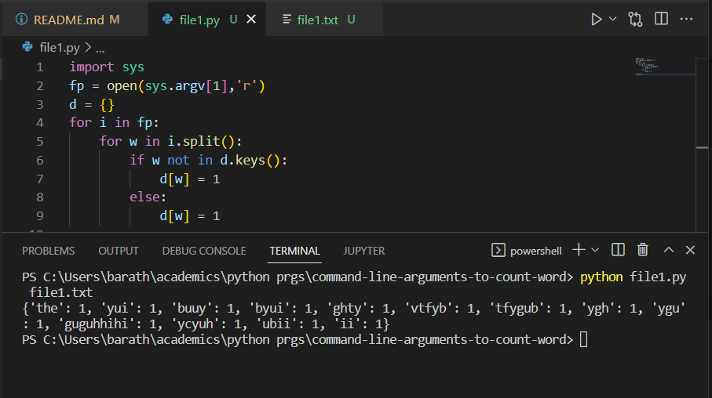

# command-line-arguments-to-count-word
## AIM:
To write a python program for getting the word count from the contents of a file using command line arguments.
## EQUIPEMENT'S REQUIRED: 
PC
Anaconda - Python 3.7
## ALGORITHM: 
### Step 1:

### Step 2: 
 
### Step 3: 

### Step 4:  

### Step 5: 

### Step 6: 

## PROGRAM:
```
Command line arguments to count words
Name: Barath S
Register no: 22008643
```
```python
import sys
count = []
with open(sys.argv[1], 'r') as f:
    for line in f:
        for word in line.split():
            if word not in count:
                count[word] = 1
            else:
                count[word] += 1
print(count)
f.close()
```
### OUTPUT:


## RESULT:
Thus the program is written to find the word count from the contents of a file using command line arguments.
